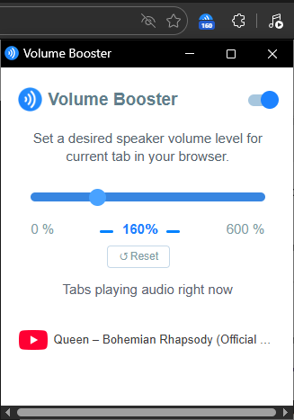

# Volume Booster

A Chrome/Edge extension to boost browser tab volume beyond 100% using the Web Audio API.

Most volume booster extensions on the store are bloated with ads, affiliate links, analytics, or outright malicious code. This one is intentionally barebones - no tracking, no remote code, no hidden behaviour. The full source is open, unminified and easy to audit yourself.

## Features

- Boost volume up to 600% per tab
- Live list of tabs currently playing audio, updated in real time
- Click any playing tab in the list to switch to it
- Keyboard shortcuts: number keys `1`–`6` jump to 100%–600%, `0` mutes, `r` reloads

## Installation

**From a release (easiest):**

1. Download `volume-booster.zip` from the [Releases](../../releases) page and unzip it
2. Go to `chrome://extensions` or `edge://extensions`
3. Enable **Developer mode**
4. Click **Load unpacked** and select the unzipped folder

**From source:**

1. Clone this repo
2. Go to `chrome://extensions` or `edge://extensions`
3. Enable **Developer mode**
4. Click **Load unpacked** and select the `src/` folder

